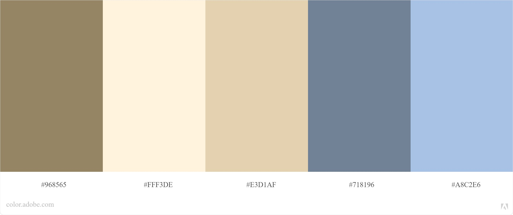

# City Explorer
**Author**: Stefanie Riehle\
**Version**: 1.0.0 (increment the patch/fix version number if you make more commits past your first submission)

## Overview
This app is created as an exercise in learning RestAPIs as well as continued learning with React components and Bootstrap styling.

## Getting Started
Created an empty repo in GitHub, then `npx create-react-app <folder name>` where you want it to go. Then used:
```
git remote add origin git@github.com:stefrie/test.git
git branch -M main
git push -u origin main
```
to connect the React app with my GitHub folder

## Architecture
Created using:
- React components
- RestAPIs
- Node.js
- APIs to:
	- LocationIQ
	- Weatherbit
	- The Movie Database
	- Yelp

## Change Log
08-23-2021 2:57pm - Added all addl files and deployed site
08-24-2021 5:18pm - Working code pushed
08-24-2021 5:30pm - Updated README.md for last commit for Lab 06

## Time Estimates and Collaborators

| Time Estimate | Name of Feature | Start Time | Finish Time | Actual Time Needed | Collaborators |
|:-------------:|:---------------:|------------|-------------|--------------------|---------------|
| 1 hour        | Lab 06 - Task 1 | 2:30pm     | 3:20 pm     | 1 hr, 20 mins      | Robert Zimmerman, Hexx King |
| 3 hours       | Lab 06 - Task 2 | 4:20pm     | ?           | ?                  | Chance Harmon |
| 2 hours       | Lab 06 - 3 & 4  | 1:00 pm    | 5:15 pm     | 4 hrs, 15 mins     | Haustin Kimbrough, JB Tellez |

## Other Resources

